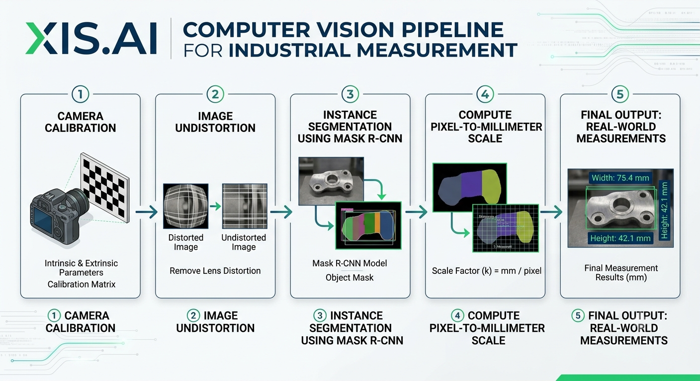

# XIS Technical Assessment: AI & Computer Vision

## Project Overview



This repository contains an end-to-end computer vision pipeline developed for the XIS AI & Computer Vision Department technical assessment. The system is designed to simulate a real-world industrial measurement workflow by:

1. Performing intrinsic camera calibration to remove lens distortion mathematically.
2. Segmenting a custom physical object (a Tissue Box) using a custom-trained Mask R-CNN (Detectron2) model.
3. Computing precise real-world metric measurements (width and height in mm) from calibrated pixel data using a reference object.

## Repository Structure

- `calibration/`: Scripts and output parameters for intrinsic camera calibration.
- `dataset/`: Directory structure for the training dataset (raw images ignored via Git).
- `models/`: Training scripts for Google Colab, instructions, and training metrics.
- `inference/`: Scripts for running the trained model on un-distorted images.
- `measurement/`: The final pixel-to-mm calculation pipeline.
- `docs/`: Comprehensive technical reports detailing methodology, metrics, and accuracy validation.

## Documentation

Please refer to the `docs/` folder for in-depth technical reports. **These are mandatory reading:**

- [Calibration Report](docs/CALIBRATION_REPORT.md)
- [Dataset Card](docs/DATASET_CARD.md)
- [Training Report](docs/TRAINING_REPORT.md)
- [Measurement Report](docs/MEASUREMENT_REPORT.md)
- [Setup & Installation](docs/SETUP.md)

## Quick Start

1. Create a virtual environment and install dependencies:

```bash
python -m venv venv
.\venv\Scripts\activate
pip install -r requirements.txt
```

2. Follow the detailed guides within each folder to replicate the calibration, training, and inference steps.
