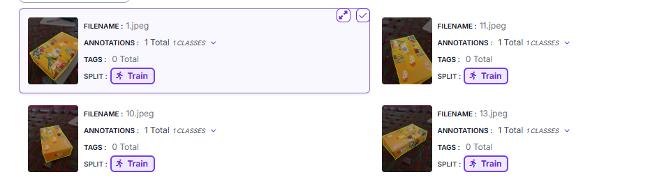

# Dataset Card

## Object Selection
- **Object**: Tissue Box
- **Ground Truth Width**: 101.6 mm
- **Ground Truth Height**: 50.8 mm
- **Reasoning**: Tissue boxes have rigid, well-defined straight edges and predictable geometries, making them an excellent choice for bounding box and instance segmentation measurements while ensuring reliable dimensional analysis.

## Collection Strategy
A dataset of over 70 images was collected using a mobile phone camera under diverse conditions, including varying viewing angles, lighting environments, and backgrounds. This diversity improves the model's robustness and generalization ability. The dataset was divided into:
- **Training Set:** 70%
- **Validation Set:** 20%
- **Test Set:** 10%

## Sample Dataset Images

*Example image from the collected tissue box dataset.*

## Labelling Tool
All images were annotated using **Roboflow**'s polygon annotation tool to create precise instance segmentation masks around the tissue box. The dataset was exported in the standard **COCO Segmentation** format for training and evaluation.

## Dataset Repository
The complete annotated dataset can be viewed on Roboflow:

🔗 **Dataset Link:** https://app.roboflow.com/dnn-nne7m/tissue_box/browse

## Class Distribution
| Class | Percentage |
|---------|------------|
| tissue_box | 100% |

This is a single-class instance segmentation dataset containing only tissue box objects.
