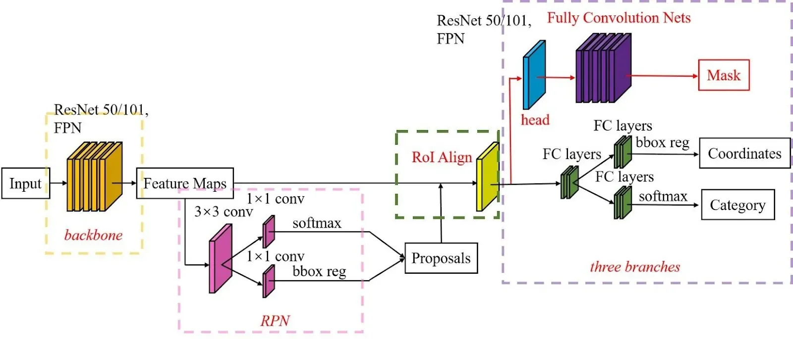
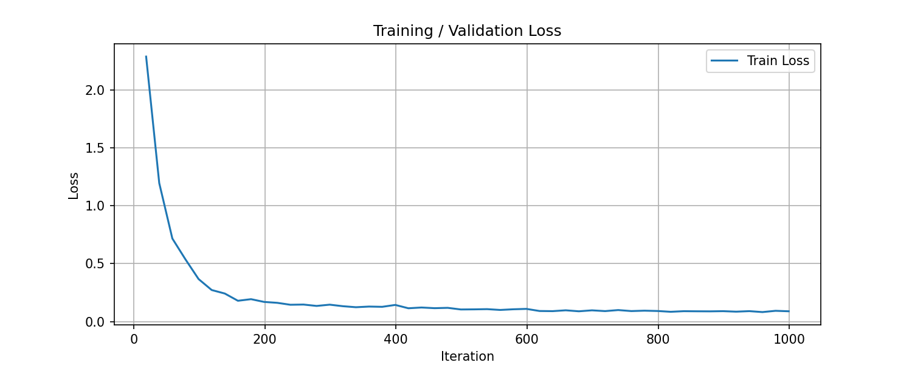
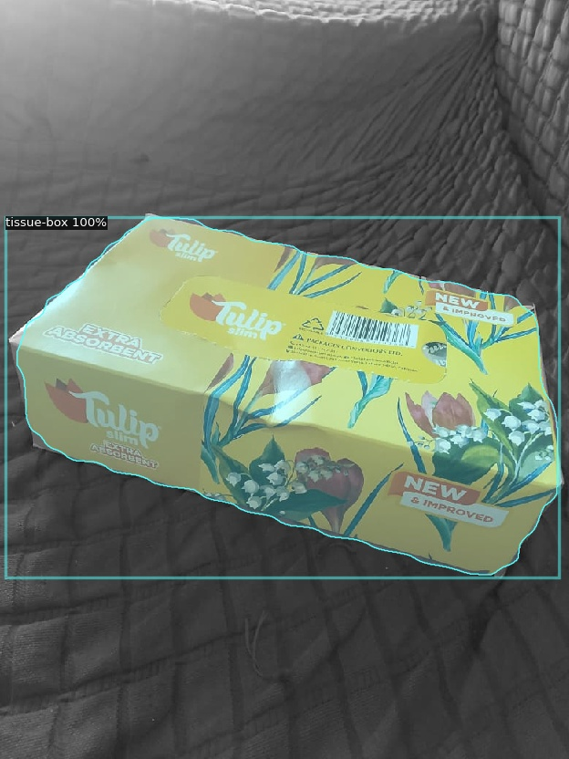
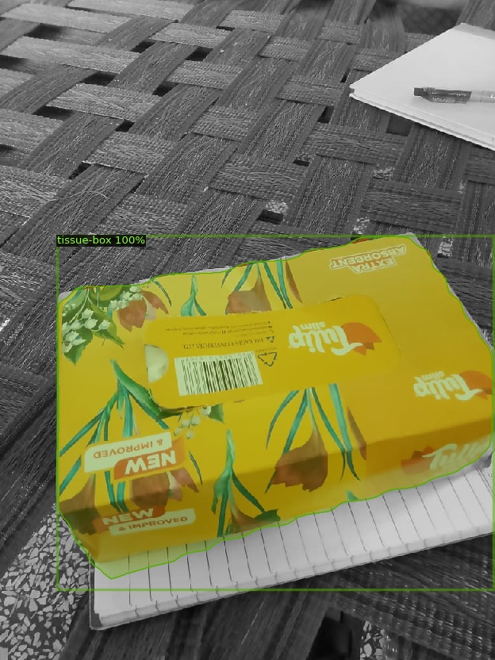
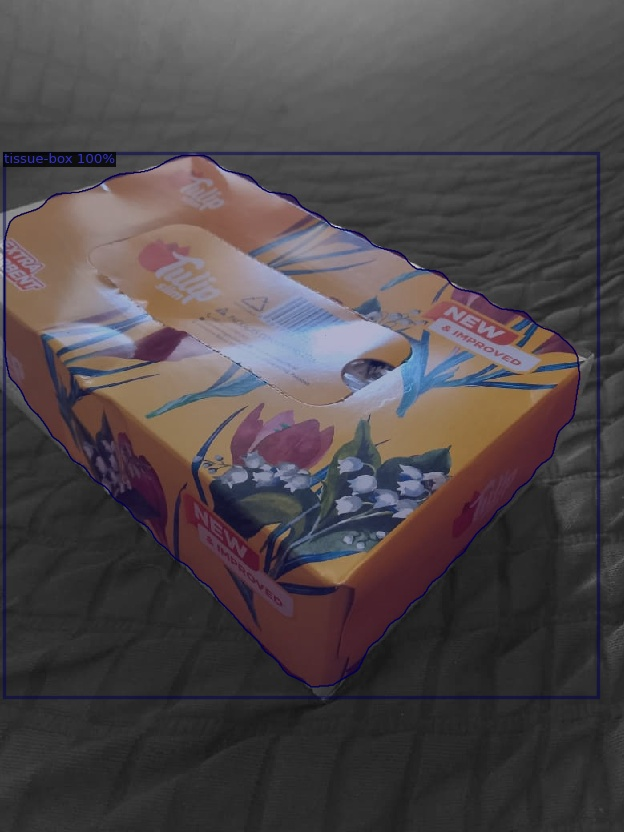

# Model Training & Segmentation Report

## Model Selection

**Architecture:** Detectron2 Mask R-CNN (ResNet-50 FPN)

**Justification:** The assessment strictly prohibited the use of Ultralytics YOLO models and Roboflow proprietary training. Detectron2, developed by Meta AI, is an industry-standard framework for instance segmentation. It provides granular control over training configurations, is distinct from YOLO, and includes robust native COCO evaluation metrics.

## Model Architecture

*Overview of the Mask R-CNN architecture consisting of a ResNet-50 backbone, Feature Pyramid Network (FPN), Region Proposal Network (RPN), bounding box head, and segmentation mask head.*

## Training Setup

- **Dataset Split:** 70% Train, 20% Validation, 10% Test
- **Base Architecture:** `mask_rcnn_R_50_FPN`
- **Iterations:** 1000
- **Batch Size:** 2 Images per Batch
- **Learning Rate:** 0.0005
- **Classes:** 1 (`tissue_box`)
- **Augmentations:** `ResizeShortestEdge` (max size 1333)

## Evaluation Metrics

The model was evaluated on the held-out validation set using the official COCO evaluator.

### Bounding Box Metrics

| Metric | Value |
|:---|:---|
| **mAP (IoU=0.50:0.95)** | 98.52% |
| **mAP@0.50** | 100.00% |
| **mAP@0.75** | 100.00% |

### Segmentation Mask Metrics

| Metric | Value |
|:---|:---|
| **mAP (IoU=0.50:0.95)** | 98.93% |
| **mAP@0.50** | 100.00% |
| **mAP@0.75** | 100.00% |

## Training Loss Curves

### Total Loss

*Training loss recorded from Detectron2's metrics logger. The steady decline demonstrates stable convergence throughout training.*

## Results on Unseen Data

The trained model was evaluated on images that were never observed during training or validation.

### Test Sample 1

*Successful segmentation of the tissue box on an unseen image with accurate mask boundaries.*

### Test Sample 2

*Model prediction under different lighting and viewing conditions.*

### Test Sample 3

*Example demonstrating robust segmentation performance on challenging backgrounds.*

## Conclusion

The model achieved near-perfect segmentation accuracy, obtaining 100% mAP at IoU=0.50 for both bounding-box detection and mask prediction. The rigid geometry and distinctive appearance of the tissue box contributed to strong performance. These highly accurate segmentation masks form the foundation of the subsequent pixel-to-millimetre measurement pipeline.
